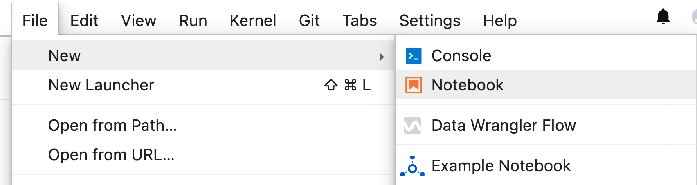
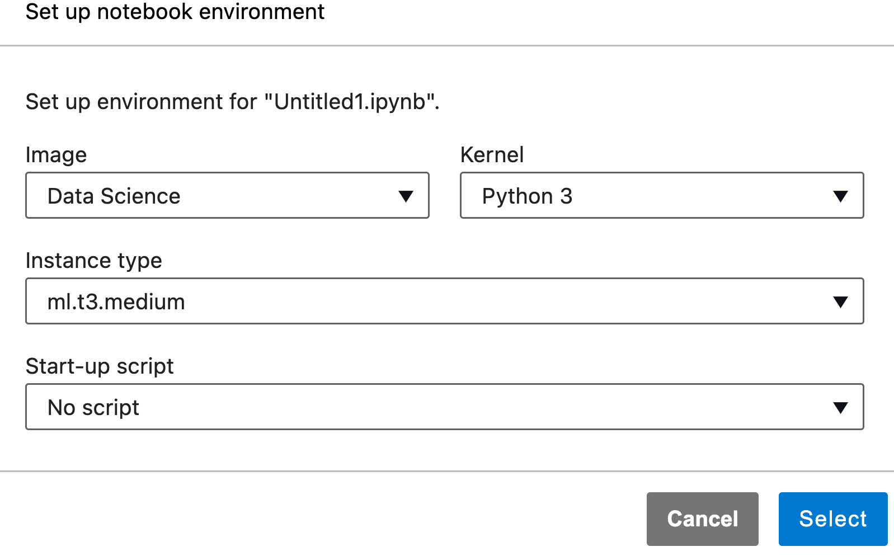

It is common for organizations to accumulate project documentation, manuals, tenders, Salesforce, slack, repositories full of code... and much more. To do a search in that sea of information of thousands of documents, you first have to find the document where it might be and then perform the search on it. OK, you found what you were looking for, but it is very long and you would like to summarize it. You could use an application on the web, but... you would be sharing your organization’s information with the world. 🚨DANGER🚨!

Follow me through this reading where I will show you how you can create a knowledge base with multiple sources, which you can ask and it will answer a summary of what you are looking for and the link to go deeper, and to make it more accessible let’s do it Q&A in any language.

We will build it in two parts:

- Build a multilingual Q&A intelligent database.
- Add summarization to a multilingual Q&A intelligent database.

## Build a multilingual Q&A intelligent database powered by generative AI! 🚀🤖🌎

 1. ### Build the smart database with [Amazon Kendra](https://aws.amazon.com/pm/kendra), using the sample data.🤖

Kendra is an intelligent search service powered by machine learning, where you can added, updated, or deleted automatically synchronize [multiples data source](https://docs.aws.amazon.com/kendra/latest/dg/hiw-data-source.html), and also index web pages by providing the URLs to crawling. 

For this exercise you are going to use the sample data of Kendra, that covers Amazon Elastic Compute Cloud (Amazon EC2), Amazon Kendra, Amazon Simple Storage Service (Amazon S3), and AWS Lambda

First you need to create a Kendra Index,to holds the contents of your documents and is structured in a way to make the documents searchable, follow the steps to create a [Kendra](https://console.aws.amazon.com/kendra/) Index in console [here](https://docs.aws.amazon.com/kendra/latest/dg/gs-console.html)


<h4 align="center">Fig 1. Create an Amazon Kendra Index. </h4> 

Once the Index is active, add a data source to an Inde (Fig. 2), select **Add data source** and then select **Add dataset**, add a name and select English(en) in Language. 


<h4 align="center">Fig 2. add a data source to an Index. </h4> 

At the end of the data synchronization, you would already have the knowledge base ready to perform queries, go to the navigation panel on the left, choose the **Search indexed content** option.


<h4 align="center">Fig 3.  Search in a Kendra Index. </h4> 


[Here](https://docs.aws.amazon.com/kendra/latest/dg/getting-started.html) you can see more ways to upload sources to Kendra. 

 Kendra delivere several sources to find the answer, but wouldn't a summarized result be better?, which leads us to the next step.

2. ### Create ENDPOINT to invoke model of summarization using Sagemaker Jumpstart🚀.

In this part you are going to use a [Amazon SageMaker Domain](https://docs.aws.amazon.com/sagemaker/latest/dg/sm-domain.html) as [Machine Learning Environments](https://docs.aws.amazon.com/sagemaker/latest/dg/machine-learning-environments.html), where AWS provides all the necessary infrastructure to train and deploy the model, which once ready you can discard, and on that environment we will use [SageMaker JumpStart](https://docs.aws.amazon.com/sagemaker/latest/dg/studio-jumpstart.html) who provides pretained, open-source models for a wide range of problemns types (as our problem to summarize) to help you get started with machine learning, and the best is you can also access a models using the [SageMaker Python SDK](https://sagemaker.readthedocs.io/en/stable/overview.html#use-sagemaker-jumpstart-algorithms-with-pretrained-models).

Now that I've introduced you to [SageMaker JumpStart](https://docs.aws.amazon.com/sagemaker/latest/dg/studio-jumpstart.html), let's start working with it:
|||
|--|--|
|1. Open the [Amazon Sagemaker console](https://console.aws.amazon.com/sagemaker/)||
|2. Find JumpStart on the left-hand navigation panel and choose Foundation models.||
|3. Search for a [**Flan UL2**](https://huggingface.co/google/flan-ul2) model, and then clicl on **View model**.||
|4. Open notebook in [Studio](https://aws.amazon.com/sagemaker/studio/)||
|5. Create a [Sagemaker Domain](https://docs.aws.amazon.com/sagemaker/latest/dg/gs-studio-onboard.html) using [Quick setup](https://docs.aws.amazon.com/sagemaker/latest/dg/onboard-quick-start.html), this takes a few minutes⏳... or **Select domain and user profile** if you already have one created. ||
|6. Follow the steps in jupyter notebook, explore it, play and wait for me in step **6.1**||

In the jupyter notebook you can use FLAN-T5 model for many NLP tasks, without fine-tuning the model, such as: 

- Text summarization
- Common sense reasoning / natural language inference
- Question and answering
- Sentence / sentiment classification
- Translation
- Pronoun resolution

Go to part 3 in jupyter notebook to deployed a [sagemaker endopoint](https://docs.aws.amazon.com/sagemaker/latest/dg/inference-recommender.html), this is the call to do [real-time inference](https://docs.aws.amazon.com/sagemaker/latest/dg/realtime-endpoints.html) to ML model as an API call, using Boto3 and AWS credentials. 

You can get the Sagemaker Endpoint in two ways:

- [SageMaker Python SDK](https://sagemaker.readthedocs.io/en/stable/overview.html#use-prebuilt-models-with-sagemaker-jumpstart): 

```code
model_predictor.endpoint_name
```

- Console:

Find **Inference** on the left-hand navigation panel and choose **Endpoints**.

🚨**Note:** You have to be careful, because while the endpoint is active, the EC2 instance is also active, so you are paying for the activity, check [pricing here](https://aws.amazon.com/es/sagemaker/pricing/).


3. ### 👩🏻‍🔬 Test the solution in a jupyter notebook 

In the same jupyter notebook from the previous step, open a new notebook.

**File -> New Notebook** (Fig. 4)


<h4 align="center">Fig 4.  Open New Notebook. </h4> 


**Set up environment of new notebook:** (Fig. 5)
- Image: Data Science 
- Kernel: Python 3
- Intance type: ml.t3.medium


<h4 align="center">Fig 5.  Set up environment of new notebook. </h4> 


## Conslusion
 Thank you for following me in this reading where an intelligent knowledge database nurtured from multiple sources is built, to which we can ask in any language, and give us summarized answers in the requested language, all in private respecting data protection.

You can improve this application by creating cache to deliver faster responses by adding an amazon DynamoDB table, in which you store the response from amazon Kendra as partition key and as sort key the summary, in this way before generating the summary you first consult the table.