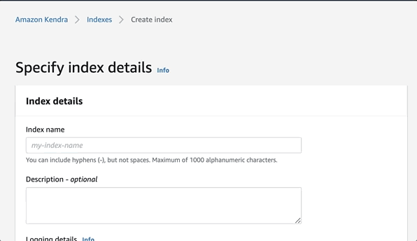
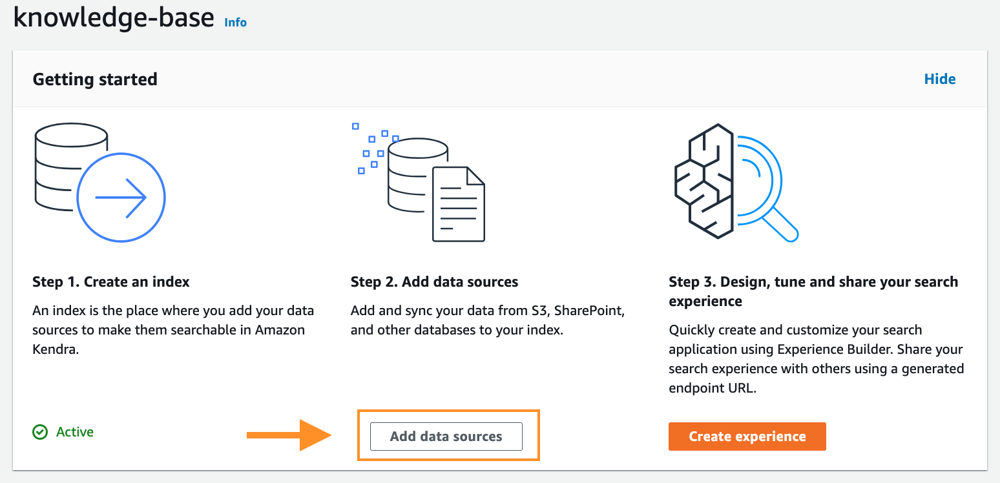
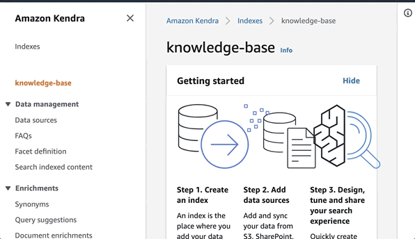
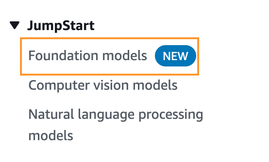
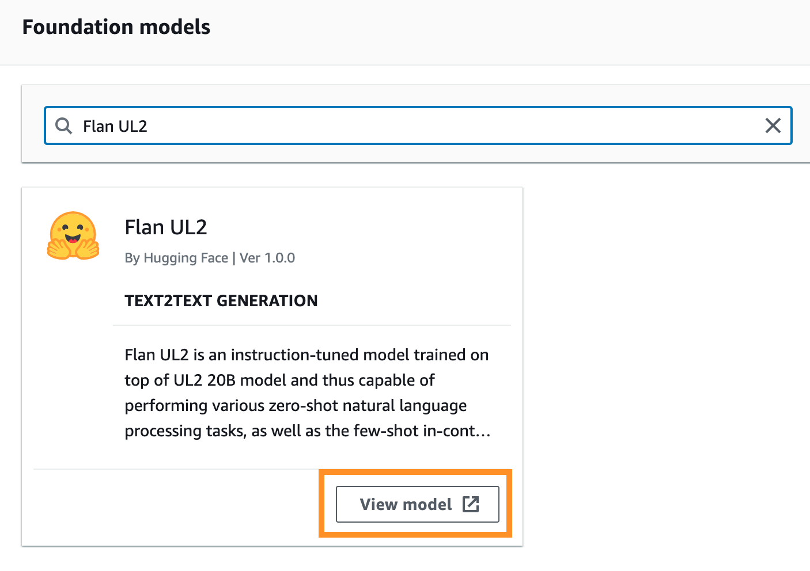
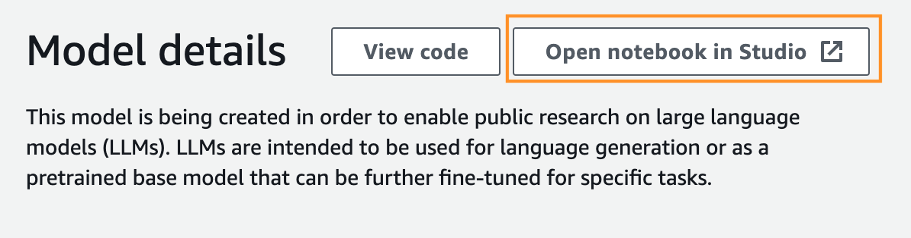
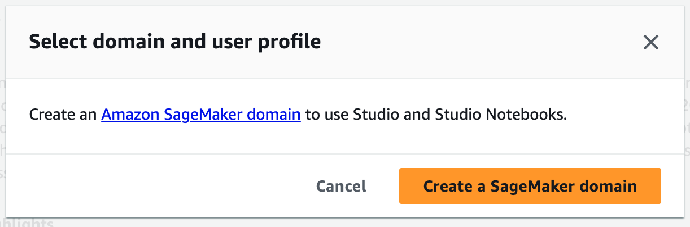
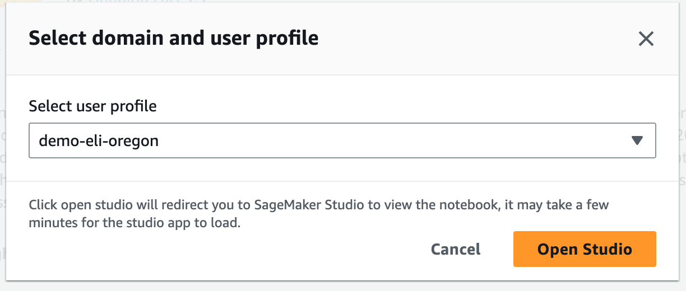
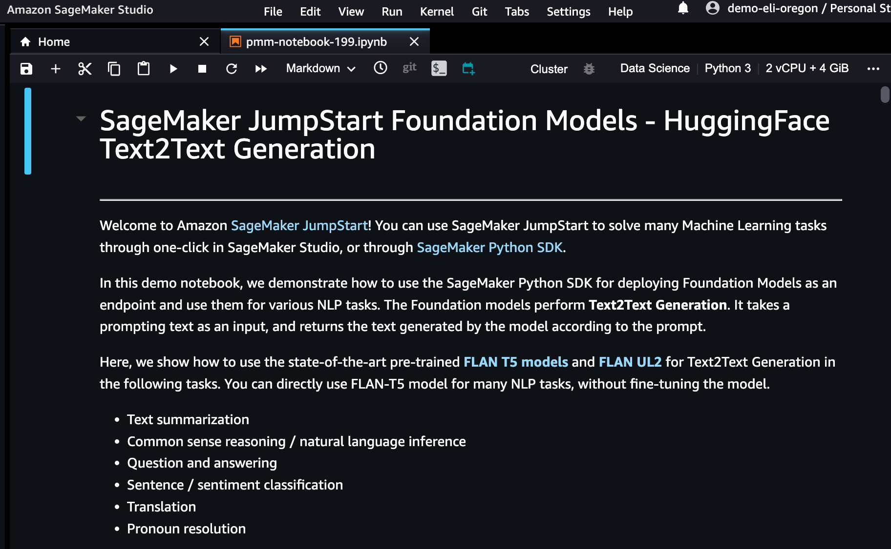

Organizations often accumulate a wide range of documents, including project documentation, manuals, tenders, Salesforce data, code repositories, and more. When searching through this vast amount of information, it can be a tedious process of locating the specific document and then conducting the search within it. Once you find the desired document, it may be lengthy, and you might prefer a summary of its content. 

Web applications are available to summarize, however you should watch out! using them could mean sharing your organization's sensitive information: 🚨DANGER🚨.

Join me in this blog as I guide you through the process of building a comprehensive knowledge base using multiple sources. With this knowledge base you can seek answers to your queries and receive concise summaries along with links for further study. To ensure accessibility, we will facilitate this process through a convenient question-and-answer format available in multiple languages.

We will build it in two parts:

- Build a multilingual Q&A intelligent knowledge base.
- Add summarization to a multilingual Q&A intelligent knowledge base.

## Build a multilingual Q&A intelligent knowledge base 🤖🌎

 1. ### Build the smart database with [Amazon Kendra](https://aws.amazon.com/pm/kendra), using the sample data.🤖

Kendra is an intelligent search service powered by machine learning, where you can add, update, or delete automatically synchronize [multiples data source](https://docs.aws.amazon.com/kendra/latest/dg/hiw-data-source.html), and also index web pages by providing the URLs to crawling. 

For this app you are going to use the sample data of Kendra, that covers Amazon Elastic Compute Cloud (Amazon EC2), Amazon Kendra, Amazon Simple Storage Service (Amazon S3), and AWS Lambda

First you need to create a Kendra Index,to holds the contents of your documents and is structured in a way to make the documents searchable, follow the steps to create a [Kendra](https://console.aws.amazon.com/kendra/) Index in console [here](https://docs.aws.amazon.com/kendra/latest/dg/gs-console.html)


<h4 align="center">Fig 1. Create an Amazon Kendra Index. </h4> 

Once the Index is active, add a data source to an Inde (Fig. 2), select **Add data source** and then select **Add dataset**, add a name and select English(en) in Language. 


<h4 align="center">Fig 2. add a data source to an Index. </h4> 

At the end of the data synchronization, you will have the knowledge base ready for queries.

[Here](https://docs.aws.amazon.com/kendra/latest/dg/getting-started.html) you can see more ways to upload sources to Kendra. 

2. ### Queries to an index in Amazon Kendra - [Documentation](https://docs.aws.amazon.com/kendra/latest/dg/searching.html)

To search an Amazon Kendra index, you use the [Query](https://docs.aws.amazon.com/kendra/latest/APIReference/API_Query.html) API and returns information about the indexed documents of Data sources. 

Amazon Kendra utilizes various factors to determine the most relevant documents based on the search terms entered. These factors include the text/body of the document, document title, searchable custom text fields, a date field for freshness, and other relevant fields. 

Additionally, filters can be applied to the search to narrow down the results, such as filtering documents based on a specific custom field like "department" (e.g., returning only documents from the "legal" department). For more information, see [Custom fields or attributes](https://docs.aws.amazon.com/kendra/latest/dg/custom-attributes.html).

You can query the Kendra API in several ways:

 **With the console**

 Go to the navigation panel on the left, choose the **Search indexed content** option, then enter a query in the text box and then press **enter** (Fig. 3).


<h4 align="center">Fig 3.  Search in a Kendra Index. </h4> 

**With AWS SDK for [Python(Boto3)](https://boto3.amazonaws.com/v1/documentation/api/latest/reference/services/kendra.html)**

``` python
import boto3

kendra = boto3.client("kendra")

def QueryKendra(index_id,query): 
    response = kendra_client.query(
        QueryText = query,
        IndexId = index_id)
    return response
```

**Others** 

With [AWS SDK for Java](https://sdk.amazonaws.com/java/api/latest/software/amazon/awssdk/services/kendra/KendraClient.html) and [Postman](https://docs.aws.amazon.com/kendra/latest/dg/searching-example.html). 


2. ### Add multilingual features

In this segment, we will use two AI/ML services as API calls:

- [Amazon Comprehend](https://aws.amazon.com/comprehend/) to detect determines the dominant language in which the question is asked, using [DetectDominantLanguage](https://boto3.amazonaws.com/v1/documentation/api/latest/reference/services/comprehend/client/detect_dominant_language.html#detect-dominant-language) from [Boto3 Comprehend client](https://boto3.amazonaws.com/v1/documentation/api/latest/reference/services/comprehend.html):

```python 
import boto3

comprehend_client = boto3.client('comprehend')

def DetectDominantLanguage (text):
    response = comprehend_client.detect_dominant_language(
    Text=text)
    return response['Languages'][0]['LanguageCode']
```

- [Amazon Translate](https://aws.amazon.com/translate/) to translate the question to the language of the Kendra knowledge base (English in this case) and translate the answer back to the language of the original question, using [TranslateText](https://boto3.amazonaws.com/v1/documentation/api/latest/reference/services/comprehend/client/detect_dominant_language.html#detect-dominant-language) from [Boto3 Translate client](https://boto3.amazonaws.com/v1/documentation/api/latest/reference/services/comprehend.html):


```python
import boto3

translate_client = boto3.client('translate')

def TranslateText(text,SourceLanguage,TargetLanguage):
    response = translate_client.translate_text(
    Text=text,
    SourceLanguageCode=SourceLanguage,
    TargetLanguageCode=TargetLanguage
)
    return response['TranslatedText']
```

If you want to know more about these services as API calls you can visit this blog: [All the things that Comprehend, Rekognition, Textract, Polly, Transcribe, and Others Do](https://www.buildon.aws/posts/all-the-things-that-comprehend-rekognition-textract-polly-transcribe-and-others-do)

To show the result converted to the original language we will use this function:

```python
def show__result (response):
    for query_result in response["ResultItems"]:

        if query_result["Type"]=="ANSWER" or query_result["Type"]=="QUESTION_ANSWER":
            answer_text = query_result['AdditionalAttributes'][0]['Value']['TextWithHighlightsValue']['Text']
            answer_text_translated = TranslateText(answer_text,TargetLanguage,SourceLanguage)
            print(answer_text_translated)
            print("Go deeper: ", query_result['DocumentURI'])   

        if query_result["Type"]=="DOCUMENT":
            if "DocumentTitle" in query_result:
                document_title = query_result["DocumentTitle"]["Text"]
                document_title_translated = TranslateText(document_title,TargetLanguage,SourceLanguage)
                print("Title: " +document_title_translated)
            document_text = query_result["DocumentExcerpt"]["Text"]
            answer_text_translated = TranslateText(document_text,TargetLanguage,SourceLanguage)
            print(answer_text_translated)
            print("Go deeper: ", query_result['DocumentURI'])        
```

By incorporating these steps, we can seamlessly handle multilingual interactions with the Kendra knowledge base.

```python
text = "¿que es s3?"
index_id = "xxxxxxxx-xxxx-xxxx-xxxx-xxxxxxxxxxxx"
TargetLanguage = "en" #English language code

SourceLanguage = DetectDominantLanguage(text)
query = TranslateText(text,SourceLanguage,TargetLanguage)
response = QueryKendra(index_id,query)
show__result (response)
```
[Language code](https://docs.aws.amazon.com/translate/latest/dg/what-is-languages.html) 

 Kendra delivere several sources to find the answer, but wouldn't a summarized result be better?, which leads us to the next step.

## Add summarization to a multilingual Q&A intelligent database.


1. ### Create ENDPOINT to invoke model of summarization using Sagemaker Jumpstart🚀.

In this part you are going to use a [Amazon SageMaker Domain](https://docs.aws.amazon.com/sagemaker/latest/dg/sm-domain.html) as [Machine Learning Environments](https://docs.aws.amazon.com/sagemaker/latest/dg/machine-learning-environments.html), where AWS provides all the necessary infrastructure to train and deploy the model, which once ready you can discard, and on that environment we will use [SageMaker JumpStart](https://docs.aws.amazon.com/sagemaker/latest/dg/studio-jumpstart.html) who provides pretained, open-source models for a wide range of problemns types (as our problem to summarize) to help you get started with machine learning, and the best is you can also access a models using the [SageMaker Python SDK](https://sagemaker.readthedocs.io/en/stable/overview.html#use-sagemaker-jumpstart-algorithms-with-pretrained-models).

Now that I've introduced you to [SageMaker JumpStart](https://docs.aws.amazon.com/sagemaker/latest/dg/studio-jumpstart.html), let's start working with it:
|||
|--|--|
|1. Open the [Amazon Sagemaker console](https://console.aws.amazon.com/sagemaker/)||
|2. Find JumpStart on the left-hand navigation panel and choose Foundation models.||
|3. Search for a [**Flan UL2**](https://huggingface.co/google/flan-ul2) model, and then clicl on **View model**.||
|4. Open notebook in [Studio](https://aws.amazon.com/sagemaker/studio/)||
|5. Create a [Sagemaker Domain](https://docs.aws.amazon.com/sagemaker/latest/dg/gs-studio-onboard.html) using [Quick setup](https://docs.aws.amazon.com/sagemaker/latest/dg/onboard-quick-start.html), this takes a few minutes⏳... or **Select domain and user profile** if you already have one created. ||
|6. Follow the steps in jupyter notebook, explore it, play and wait for me in step **6.1**||

In the jupyter notebook you can use FLAN-T5 model for many NLP tasks, without fine-tuning the model, such as: 

- Text summarization
- Common sense reasoning / natural language inference
- Question and answering
- Sentence / sentiment classification
- Translation
- Pronoun resolution

Go to part 3 in jupyter notebook to deployed a [sagemaker endopoint](https://docs.aws.amazon.com/sagemaker/latest/dg/inference-recommender.html), this is the call to do [real-time inference](https://docs.aws.amazon.com/sagemaker/latest/dg/realtime-endpoints.html) to ML model as an API call, using Boto3 and AWS credentials. 

You can get the Sagemaker Endpoint in two ways:

- [SageMaker Python SDK](https://sagemaker.readthedocs.io/en/stable/overview.html#use-prebuilt-models-with-sagemaker-jumpstart): 

```code
model_predictor.endpoint_name
```

- Console:

Find **Inference** on the left-hand navigation panel and choose **Endpoints**.

🚨**Note:** You have to be careful, because while the endpoint is active, the EC2 instance is also active, so you are paying for the activity, check [pricing here](https://aws.amazon.com/es/sagemaker/pricing/).


2. ### 👩🏻‍🔬 Add summarization features

```python
import json
endpoint_name = 'you-endpoint-name'

newline, bold, unbold = "\n", "\033[1m", "\033[0m"

def query_endpoint_with_json_payload(encoded_json, endpoint_name):
    client = boto3.client("runtime.sagemaker")
    response = client.invoke_endpoint(
        EndpointName=endpoint_name, ContentType="application/json", Body=encoded_json
    )
    return response

def parse_response_multiple_texts(query_response):
    model_predictions = json.loads(query_response["Body"].read())
    generated_text = model_predictions["generated_texts"]
    return generated_text

num_return_sequences = 3
parameters = {
    "max_length": 50,
    "max_time": 50,
    "num_return_sequences": num_return_sequences,
    "top_k": 50,
    "top_p": 0.95,
    "do_sample": True,
}
```

```python
def summarization(text):
    
    payload = {"text_inputs": f"Briefly summarize this sentence: {text}", **parameters}
    query_response = query_endpoint_with_json_payload(
            json.dumps(payload).encode("utf-8"), endpoint_name=endpoint_name
        )
    generated_texts = parse_response_multiple_texts(query_response)
    print(f"{bold} The {num_return_sequences} summarized results are{unbold}:{newline}")
    for idx, each_generated_text in enumerate(generated_texts):
        answer_text_translated = TranslateText(each_generated_text,TargetLanguage,SourceLanguage)
        print(f"{bold}Result {idx}{unbold}: {answer_text_translated}{newline}")  

    return
```

```python
def show_result_answer (response):
    for query_result in response["ResultItems"]:

        if query_result["Type"]=="ANSWER" or query_result["Type"]=="QUESTION_ANSWER":
            answer_text = query_result['AdditionalAttributes'][0]['Value']['TextWithHighlightsValue']['Text']
            resume(answer_text)
            print("Go deeper: ", query_result['DocumentURI'])
```

```python
SourceLanguage = DetectDominantLanguage(text)
query = TranslateText(text,SourceLanguage,TargetLanguage)
response = QueryKendra(index_id,query)
show_result_answer(response)

```


## Conslusion
Thank you for joining me on this journey, where we build a database of intelligent knowledge from various sources. This database allows us to make inquiries in any language, receiving summarized responses in the desired language, all prioritizing data privacy.

To enhance the performance of this application, we can introduce a caching mechanism by incorporating an Amazon DynamoDB table. In this table, we can store the responses obtained from Amazon Kendra, utilizing the response as the partition key and the summary as the sort key. By implementing this approach, we can first consult the table before generating the summary, thereby delivering faster responses and optimizing the overall user experience.

Some links for you to continue learning:

- [Welcome to Kendra Essentials+](https://catalog.us-east-1.prod.workshops.aws/workshops/df64824d-abbe-4b0d-8b31-8752bceabade/en-US)

- [Integrate Amazon Kendra and Amazon Lex using a search intent ](https://aws.amazon.com/es/blogs/machine-learning/integrate-amazon-kendra-and-amazon-lex-using-a-search-intent/)