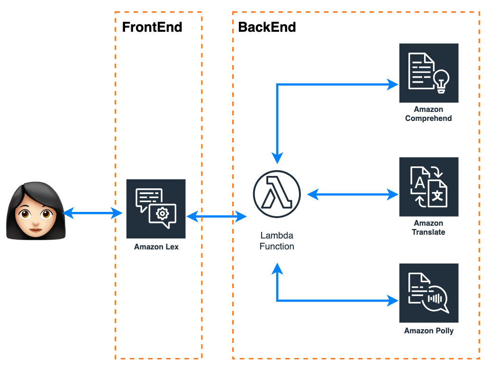

Would you imagine that you could create your own translator application in just a few steps? That it´s capable of identifying the language you are writing in, multilengual translator? and also delivers an audio file with the correct pronunciation?, yes, Today it is possible by combining AWS services. 

In this blog you are going to create a translator chatbot app, with [Amazon Lex](https://aws.amazon.com/lex/) like the chatbot that will responsible for capturing text or audio you want to translate, you will use an Amazon lambda function like hook with the code of:
-	[Amazon Comprehend]() in charge of detecting the language entered.
-	[Amazon Translate]() it will translate into the desired language.
-	[Amazon Polly]() it delivers the audio with the correct pronunciation. 

<h4 align="center">Fig 1. Diagram translator chatbot app. </h4> 

You can do all this in less than 30 minutes, don’t you believe me? Continue reading and you will see what’s the truth.

## Let's do the translator chatbot app! 🚀🤖🌎

 1. ### Configure the chatbot interface🤖

 First, you will do this step from the Amazon Lex console, [access](https://console.aws.amazon.com/lex/), and follow steps [To create an Amazon Lex V2 bot (Console)](https://docs.aws.amazon.com/lexv2/latest/dg/exercise-1.html#:~:text=To%20create%20an%20Amazon%20Lex%20V2%20bot%20(Console)) for the **Creation method** chosse **Create a blank bot** and [To add a language to a bot](https://docs.aws.amazon.com/lexv2/latest/dg/exercise-1.html#:~:text=To%20add%20a%20language%20to%20a%20bot), when you're done you should see something like fig. 2

<h4 align="center">Fig 2. Successfully created bot. </h4> 

 Before continue, you must know the components of [Lex](https://docs.aws.amazon.com/lexv2/latest/dg/how-it-works.html), let's see:

 |Component|Descripcion|Value|
 |--|--|--|
 |**Language**| You can select any [Languages and supported by Amazon Lex V2.](https://docs.aws.amazon.com/lexv2/latest/dg/how-languages.html)|English (US)|
 |**Intent**|An intent represents an action that the user wants to perform|Translate|
 |**Slot types**|An intent can require zero or more slots, or parameters. You add slots as part of the intent configuration|<ul>**Name    -    Type    -    Values**<li>language_in - Custom - es, pt, it, fr, en ([More in Languages supported in Amazon Comprehend](https://docs.aws.amazon.com/comprehend/latest/dg/supported-languages.html))</li><li>text_to_translate - Custom - [0-9][a-z][A-Z]</li><li>	language_out - Custom - italian, spanish, portuguese, french, english ([More in Languages supported in Amazon Translate](https://docs.aws.amazon.com/translate/latest/dg/what-is-languages.html))</li></ul>|
 |**Utterances**|Indicate the user's intent, activate the chat. It should be in the language of the chatbot |<ul><li>I want to translate </li><li>I want to do a translation </li></ul>|
 |||

The next step is to create the flow of the conversation using the information from the components. 

The language already selected in the previous step, so change the name of Intent in **Intent details** -> **Intent Name** and then **Save Intent**. 

<h4 align="center">Fig 3. Intent Name. </h4> 

In the menu on the left select **Slot Types** and create the slots (language_in, text_to_translate, language_out) like a blank slot type, hen you're done you should see something like fig. 4 and fig. 5.

<h4 align="center">Fig 4. Slot type created. </h4> 

Now go to **Intente** > **Translate** fill **Sample utterances** with the values of utterances, and in **Slot** menu add the slots according to the following information:

|Name|Slot type|Prompts|
|--|--|--|
|text|text_to_tanslate|What do you want to translate? Just type or speak(only in English) and I'll tell you the language... magic?|
|languageout|language_out|What language do you want to translate?|
|languagein|languague_in|what language is?|
|||

<h4 align="center">Fig 5. Slots created. </h4> 

This chatbot will work with a Lambda function that will carry the conversation, so the prompts for the *languageout* and *languagein* slot will be delivered by the Lambda function, so you can put any text in the prompt value.

This way of transporting values or parameters in the slots during the conversation session can also be done using [session attributes](https://docs.aws.amazon.com/lexv2/latest/dg/context-mgmt-session-attribs.html), were Lambda function adds or updates the values too. 

To finish creating the chatbot, press **Save intent** and then **Build** in the top left.

 2. ### Configure the Lambda function hook 🤖

 3. ### let's try the app 

 4. ### Optional - 

 ## Conclusion

 I didn’t lie to you; it took you more or less 30min to build your own translator chatbot app capable of identifying the language of what you want to translate, translates it, and also delivers an audio file with the correct pronunciation. Now you unlocked a new skill, Keep unlocking skills by building new apps. I leave you some links where you can find new ideas.